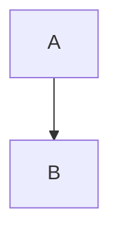

# Coffee shop pricing report

Alex Doe studied a coffee shop in Rotterdam. See [[Price Elasticity]] and [[Porter Five Forces|the five forces]].
A link to a heading: [[Price Elasticity#Measuring it]] and a block link [[Price Elasticity#^key-point]].

%% This comment should vanish %%
Visible text after an inline comment.

%%
A block comment
over two lines.
%%

## Key idea

![[Price Elasticity]]

## Only one section

![[Price Elasticity#Measuring it]]

## One block

![[Price Elasticity#^key-point]]

## Picture

![[demand curve.png|Demand falls as price rises|300]]

![[demand curve.png|200x100]]

A ==highlighted phrase== sits in this line. This line has a block id. ^para-1 #pricing #course/mba

## Callouts

> [!note] A plain note
> The owner wants to raise the price.
> Second line.

> [!tip]- Folded tip
> Check the till data first.

> [!warning]
> Do not guess the costs.

> [!success] Done well
> Costs are known.

> [!quote] A classmate
> Prices are a story.

> [!info] Outer
> Outer text.
>
> > [!danger] Inner
> > Inner text.

## Code stays as it is

Inline `[[not a link]]` and `%% not a comment %%` stay.

```python
print("[[not a link]]")  # %% stays %%
```

```dataview
TABLE file.name FROM "20_areas"
```



## Table

| Idea | Link |
|---|---|
| Elasticity | [[Price Elasticity\|elasticity]] |

## Missing things

![[Does Not Exist]]

![[missing picture.png]]
